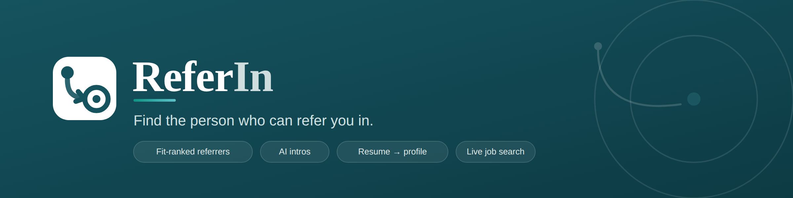

<p align="center">
  
</p>

<p align="center">
  <em>The hiring network built on a warm intro, not a cold application.</em>
</p>

ReferIn helps job-seekers find the right internal referrer at their target company. Paste a job description, get a ranked list of employees whose background aligns with the role, generate a personalised outreach message, send a referral request, and keep track of everyone you've already contacted — all in one place. It also browses live job listings and turns your resume into a profile automatically.

---

## What it does

- **Paste-to-search** — drop in any job description from LinkedIn, Greenhouse, Lever, Workday, or anywhere; role, company, skills, tech stack and location are extracted automatically via DeepSeek. No boolean filters, no scrolling.
- **Fit-ranked referrers** — employees are scored by TF-IDF cosine similarity between the job, the person's background, and your own profile, with bonuses for shared schools, past employers and connections.
- **Live referrer sourcing** — searches GitHub org members and users in real time, supplements with AI-suggested profiles from DeepSeek for thin coverage, and falls back to the seed database. Every result is labelled **Live from GitHub**, **AI suggested**, or **From database**.
- **AI-drafted intros** — each referrer comes with a personalised, editable outreach message built from the job and your profile. Copy or send in one click.
- **Contacted tracking** — sent requests are remembered per person, with a "Requested" badge, a hide-contacted filter, and matching across searches, so you never message the same person twice.
- **Resume → profile** — upload a PDF/DOCX and skills, education and experience are extracted automatically into a review-and-confirm step; edit your profile, add a photo, and match scores update immediately.
- **Built-in job search** — browse live openings by role, company and country (roles auto-suggested from your profile), then jump straight from any listing into referrer search.
- **Polished, themeable UI** — six light/dark themes, auto-growing inputs, live form validation, a Terms & Conditions step on signup, and clean empty states throughout.

---

## Tech stack

| Layer | Technology |
|---|---|
| Frontend | React 19, Vite, Tailwind CSS |
| Backend | Python 3.10+, Flask, SQLite |
| Referrer discovery | GitHub REST API (live org/user search) + DeepSeek (AI-suggested profiles) |
| Job parsing & resume extraction | DeepSeek (`deepseek-chat`) |
| Job listings | JSearch via RapidAPI |
| AI coaching | Ollama (optional, local — `llama3.2:3b` default) |
| Matching | Skill synonym map + TF-IDF cosine similarity (pure Python, no ML deps) |

---

## Project structure

```
referai/
├── referai-backend/
│   ├── app.py              # All Flask routes, DB schema, matching logic, seed data
│   ├── .env.example        # Environment variable reference — copy to .env and fill in
│   ├── referai.db          # SQLite database (auto-created on first run, gitignored)
│   └── requirements.txt    # Python deps (Flask, flask-cors, pdfplumber, python-docx)
│
├── referai-frontend/
│   ├── src/
│   │   ├── pages/          # Landing, Auth, Terms, Student (Find Referrers), Jobs, Profile
│   │   ├── components/     # TagInput, AutocompleteInput, ExtractionPreview, AutoGrowTextarea,
│   │   │   └── common/     #   Layout, Header, Sidebar, Avatar, Logo
│   │   ├── utils/          # validation (email + password rules)
│   │   └── services/api.js # All fetch calls to the backend
│   ├── package.json
│   └── vite.config.js
│
├── assets/banner.svg       # README banner (on-theme)
├── presentation/           # Pitch deck (ReferIn-Pitch.html) + content reference (PITCH.md)
├── to-do.md                # Feature roadmap (statuses kept up to date)
└── how-to-run.md           # Step-by-step setup guide
```

---

## Seed data

The database seeds automatically on first run:

- **15 users** — diverse job-seekers from Indian colleges (IIT, BITS, NIT, IIIT, DTU, etc.)
- **500 employees** — 50 per company across 10 companies (Stripe, Google, Microsoft, Flipkart, Netflix, Amazon, Razorpay, Zepto, Meesho, Swiggy), spread across Engineering, Data/ML, DevOps, Mobile, Security, and Product departments

Live search via GitHub and DeepSeek always runs first; the seed DB is only the last-resort fallback.

---

## Quick start

See **[how-to-run.md](how-to-run.md)** for the full setup guide.

**TL;DR — two terminals:**

```bash
# Terminal 1: backend
cd referai-backend
cp .env.example .env           # fill in DEEPSEEK_API_KEY and GITHUB_PAT
python -m venv venv && source venv/bin/activate
pip install -r requirements.txt && python app.py

# Terminal 2: frontend
cd referai-frontend && npm install && npm run dev
```

Open **http://localhost:5173** and log in with any seed account (e.g. `arjun.sharma@seed.referai` / `referai123`).

---

## Seed login credentials

Any of the 15 seed users can be used to log in. All share the password `referai123`.

| Email | Password |
|---|---|
| `arjun.sharma@seed.referai` | `referai123` |
| `priya.nair@seed.referai` | `referai123` |
| `rahul.verma@seed.referai` | `referai123` |

> Full list: `arjun.sharma`, `priya.nair`, `rahul.verma`, `sneha.patel`, `karthik.rajan`, `ananya.krishnan`, `rohan.mehta`, `divya.iyer`, `vikram.singh`, `meera.subramanian`, `aditya.kumar`, `pooja.desai`, `nikhil.gupta`, `shreya.chatterjee`, `tanvi.shah` — all at `@seed.referai`. Create a new account via the signup page to test with a custom profile.

---

## Environment variables

Set in `referai-backend/.env` (copy from `.env.example`).

| Variable | Required | Purpose |
|---|---|---|
| `DEEPSEEK_API_KEY` | **Yes** | Job parsing, resume extraction, AI employee suggestions |
| `GITHUB_PAT` | **Yes** | Live employee search via GitHub org/user API |
| `RAPIDAPI_KEY` | For job search | Live job listings via JSearch (Browse Jobs) |
| `OLLAMA_BASE_URL` | No | Local Ollama server for AI coaching (default: `http://127.0.0.1:11434`) |
| `OLLAMA_MODEL` | No | Ollama model to use (default: `llama3.2:3b`) |
| `VITE_API_BASE_URL` | No | Backend URL the frontend points at (default: `http://127.0.0.1:5000`) |

The app runs without `DEEPSEEK_API_KEY` and `GITHUB_PAT` but employee search and job parsing will fall back to the seed database only. Without `RAPIDAPI_KEY`, the Browse Jobs page returns no listings.

---

## Contributing

Branch off `main`, work on a feature branch, open a PR back to `main`. The active development branch is `Breeti`.

See `to-do.md` for planned features and their current status.
